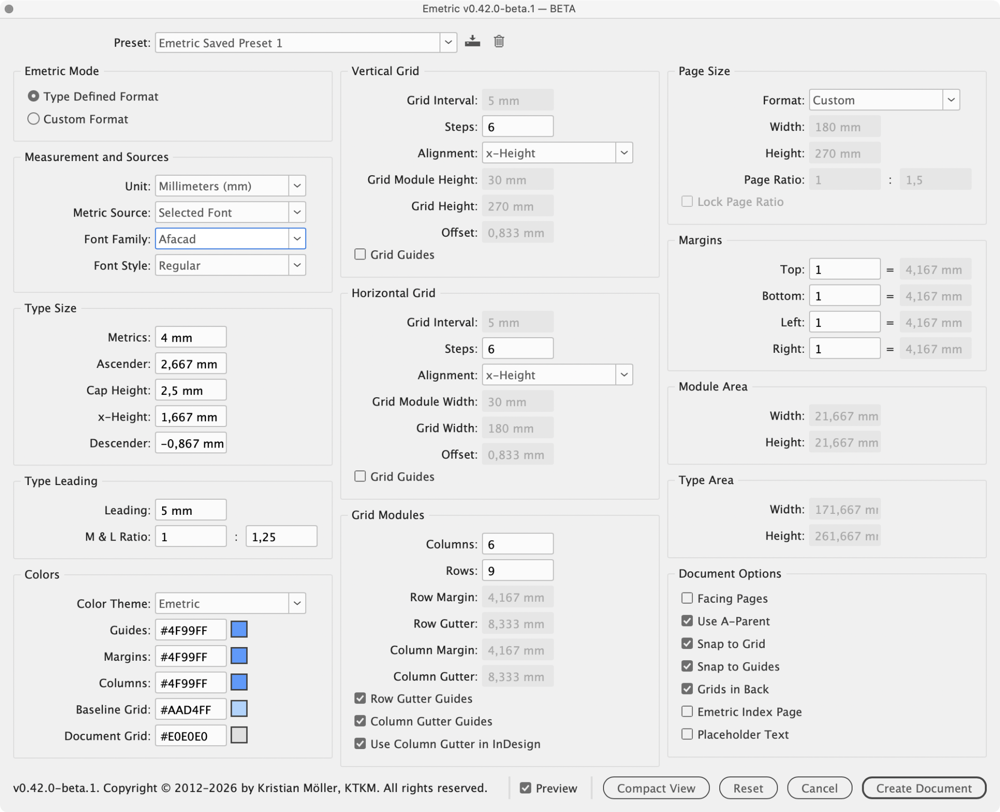
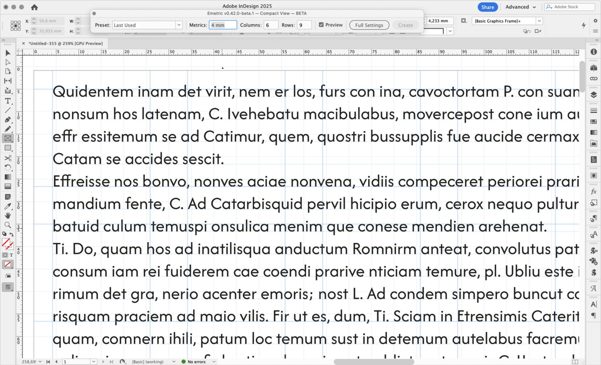

# Emetric 0.42.0-beta.3 — Cross-version Consistency and Rounding Fixes

A follow-up to beta.2 of **Emetric**, a typographic proportioning tool for Adobe InDesign. No new features — this release fixes bugs reported during beta.2 testing, most notably a set of related rounding and font-measurement issues that could make identical typed values produce different results depending on Metric Source or InDesign version.

## Download

Download the release asset ZIP, unzip it and run:

```text
Emetric-0.42.0-beta.3.jsx
```

## Screenshots






## Fixed since beta.2

- Typing "1" into **Metrics** while **Picas** (or Cicero/Didot Point) was active could display "4p0" instead of "1p0", with margins, grid and page size all reflecting the wrong number.
- **Custom Metric** versus **Selected Font** with identical typed x-Height and Leading could give different Margin, Row Margin and Row Gutter values even though Offset matched.
- **Offset** could round a value like 0,834 mm where the project's rule called for 0,833 mm, from a floating-point artifact in `round()`'s own multiplication; Margin, Row Margin and Row Gutter are unaffected.
- The same font and Metrics value could measure a different x-Height/Cap Height on InDesign 2026 than on InDesign 2025, so a grid built on one InDesign version didn't reproduce on the other. x-Height and Cap Height are now read directly from the font file's own OS/2 table, confirmed by testing to give identical results on both InDesign 2025 and 2026.
- The **Save Preset** / **Delete Preset** icons no longer become nearly invisible when disabled under the **Medium Dark** UI brightness setting.
- Selecting **Picas** as the measurement unit no longer labels correctly computed values with a "c" (Cicero) instead of "p".

See [`CHANGELOG.md`](CHANGELOG.md) and [`RELEASE_NOTES.md`](RELEASE_NOTES.md) for full details.

## Beta feedback wanted

Please report bugs with:

- Emetric version;
- Adobe InDesign version;
- operating system;
- selected font and style;
- Metric Source and page settings;
- screenshots or screen recordings if possible.

## License

Emetric is distributed under the **Emetric Beta License**. It is free for evaluation and beta testing, but it is not open source. Redistribution, resale and repackaging are not permitted without written permission. Future stable releases may require a paid commercial license.
